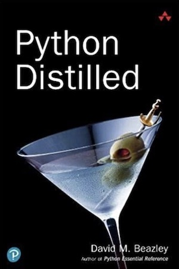

# Python Distilled



Welcome!  This repo contains errata related to the [Python
Distilled](https://www.dabeaz.com/python-distilled) book by [David Beazley](https://www.dabeaz.com).
If you'd like to contribute, please submit an issue or pull request.

## Errata

* Table 1.2. Description for `round(a, [n])` should state that it rounds to the nearest multiple of 10 to the -nth power.

* Section 1.8, pg. 15.  `['SYM', '123', '456.78']` should include the newline and be `['SYM', '123', '456.78\n']`

* Section 2.7, pg. 44.  The function invocation of `foo(3, a)` should be `f(3, a)`.

* Section 2.14, pg. 52. The list comprehension example should use `squares` instead of `nums`.

```python
nums = [1, 2, 3, 4, 5]
squares = [ ]
for n in nums:
    squares.append(n*n)
```

* Section 4.8, pg. 88.  `compute_cost(prices, quantities)` should be `compute_cost(prices, units)`.

* Section 6.4, pg. 145.   The code for `print_matching()` should be as follows:

```python
def print_matching(lines, substring):
    for line in lines:
        if substring in line:     # line instead of lines
	    print(substring)
```

* Section 7.23, pg. 200.   Typos in the date `today()` constructor.  Should be

```python
@classmethod
def today(cls):
    t = time.localtime()
    self = cls.__new__(cls)    # Make instance
    self.year = t.tm_year
    self.month = t.tm_mon
    self.day = t.tm_mday
    return self
```

* Section 7.26, pg. 208.  Typo (missing "that").  "A proxy is an object that exposes..."

* Section 7.28, pg. 212.   `del f.owner` should be `del a.owner` in example.

* Section 9.3, pg. 250. `format(x, '<*10.2f')` should be `format(x, '*<10.2f')`.

* Section 9.3, pg, 252. `'Value is {val:<*10.2f}'.format(val=x)` should be `'Value is {val:*<10.2f}'.format(val=x)`.

* Section 9.9, pg. 264. `for filename in path.Path('dirname').glob('*.txt')` should be `for filename in pathlib.Path('dirname').glob('*.txt')`.

* Section 9.15.19, pg. 285.  `serv` should be `server` in the SMTP example:

```python
server = smtplib.SMTP('localhost')
server.sendmail(fromaddr, toaddrs, msg)
server.quit()
```


## Acknowledgements

The following individuals have contributed errata:

* Said van de Klundert
* David Dyck
* Scythal
* Feng Guo
* Xavier Noria
* Evan Friedenberg
* Karthik-d-k
* Marc Hertzog
* Jack Rubin


